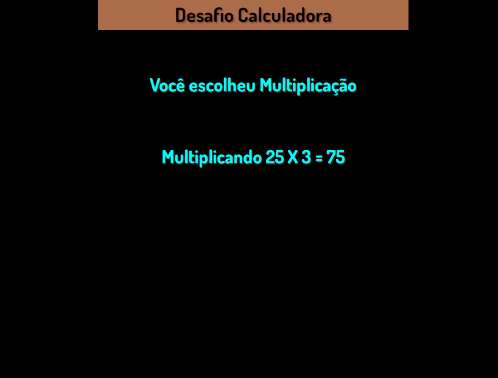

## exercicio-calculadora
### Esse programa mostra ao usuário a opção de escolher uma das quatro operações matemáticas.
### Uma vez que usuario escolhe a opção desejada, o programa mostra o resultado da operação.
[]

#### Tecnologias utilizadas:
- HTML
- CSS
- JavaScript
#### [Clique aqui para visualizar no navegador](https://alanpedrod.github.io/exercicio-calculadora/) 
